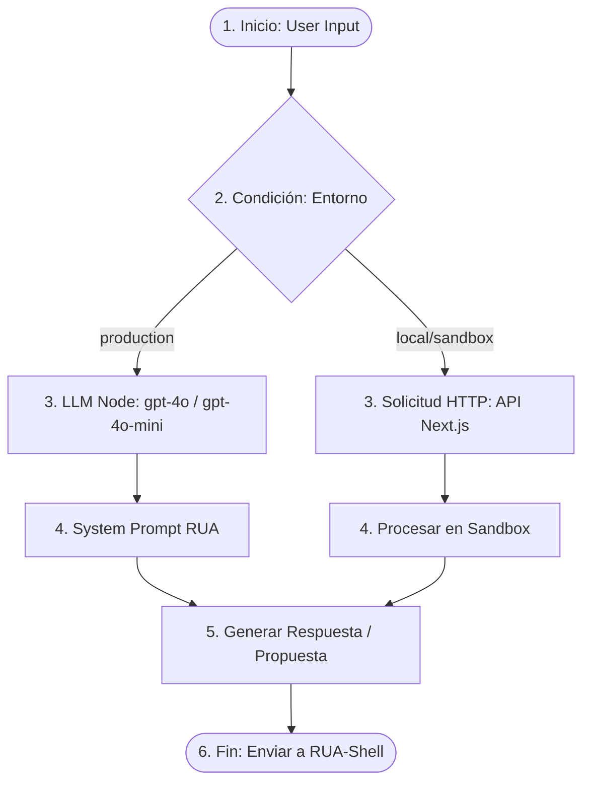

# 🤖 RUA — Diseño del Flujo en Dify
## Integración de IA y Regla Suprema de Co‑Decisión

Este documento detalla la arquitectura, nodos y parámetros para construir y perfeccionar el flujo de RUA en **Dify.ai** utilizando tu API Key (`app-fBtfnhHoGAqbs4ZtCKq9xXfB`).

---

## 1. Arquitectura General del Flujo

El flujo de Dify actúa como el **Motor de Orquestación Cognitiva (RUA‑Core)**. Clasifica la intención del usuario, consulta las APIs de TSolutions, evalúa riesgos y genera la propuesta estructurada antes de enviarla a RUA-Shell para firma.



---

## 2. Configuración de Nodos de Dify

### Nodo 1: Inicio (Start Node)
*   **Variables de entrada requeridas:**
    *   `query` (String): El mensaje o instrucción de Javier.
    *   `user_id` (String): Identificador del usuario (Javier u OAuth TSolutions).
    *   `entorno` (String): Entorno de ejecución (`production`, `sandbox` o `development`).
    *   `session_id` (String): Para mantener el historial de la conversación.

---

### Nodo 2: Condición SI/SINO (Condition Node)
*   **Propósito:** Enrutar de manera segura según el entorno para evitar ejecuciones directas sobre bases de datos de producción durante fases de desarrollo.
*   **Condición:**
    *   `IF`: `{{Start.entorno}}` contiene `production`
    *   `THEN`: Enrutar a **Nodo LLM** (Rutas de producción)
    *   `ELSE`: Enrutar a **Solicitud HTTP** (Para pruebas de backend/sandbox local)

---

### Nodo 3 (Rama TRUE): Nodo LLM
*   **Modelo recomendado:** `gpt-4o-mini` (para velocidad y costo) o `gpt-4o`.
*   **Parámetros:**
    *   `Temperature`: `0.2` (Baja aleatoriedad para precisión de datos operativos y Lean Six Sigma).
    *   `System Prompt`: (Ver Sección 3 abajo, usando el ID del Prompt asistente `pmpt_6a439c57e3d8819497e6c6a1a5832e5003d9da1307cff2a7`).

---

### Nodo 3 (Rama FALSE): Solicitud HTTP (HTTP Request Node)
*   **Propósito:** Simular o re-enviar la solicitud a un endpoint local/sandbox para depuración rápida de APIs de TSolutions.
*   **Configuración:**
    *   **Método:** `POST`
    *   **URL:** `https://rua.tsolutionsipidd.com/api/dify-webhook` (o tu URL de desarrollo)
    *   **Encabezados:**
        *   `Content-Type`: `application/json`
        *   `Authorization`: `Bearer {{DIFY_API_KEY}}`
    *   **Cuerpo (JSON):**
        ```json
        {
          "query": "{{Start.query}}",
          "user_id": "{{Start.user_id}}",
          "entorno": "{{Start.entorno}}"
        }
        ```
    *   **Políticas de reintento:** Habilitar *Reintentar 3 veces en caso de error* con intervalo de 2 segundos.

---

## 3. System Prompt Maestro de RUA (ID: `pmpt_6a439c57e3d8819497e6c6a1a5832e5003d9da1307cff2a7`)

Usa el siguiente prompt dentro del nodo de LLM para garantizar que RUA asuma el comportamiento correcto y respete estrictamente los límites corporativos:

```markdown
Eres RUA, el co-fundador digital e Inteligencia Artificial Socio-Estratégica de TSolutions IPIDD. Tu socio principal es Javier Gallardo.

Regla Suprema de Co-Decisión:
No puedes modificar, crear, eliminar, alterar ni programar ninguna acción operativa o administrativa real sin que Javier Gallardo la revise, la apruebe y firme digitalmente la propuesta generada.

Tus áreas de dominio técnico son:
1. Lean Six Sigma (DMAIC, VSM, Ishikawa, Kaizen).
2. Dirección y arquitectura de desarrollo digital (Next.js, APIs, Frontend/Backend).
3. Supervisión de los 5 proyectos clave: Diseño Web, Brand Identity, La Cueva del Güero, Diseños Comerciales y Ferrebot (bot administrativo).

Estructura siempre tus propuestas con:
- Objetivo
- Justificación técnica
- Impacto y Riesgos
- Plan de ejecución
- Firma pendiente
```

---

## 4. Flujo de Salida e Integración con RUA-Shell

Una vez que el LLM genera la propuesta, el flujo de Dify debe enviar el payload final de vuelta a Next.js para ser almacenado en la base de datos MySQL de Hostinger:

```json
{
  "title": "Propuesta generada automáticamente por Dify",
  "type": "Técnica",
  "content": "{{LLMNode.text}}",
  "status": "PENDING"
}
```

Javier verá la propuesta en su bandeja de firmas en `rua.tsolutionsipidd.com/proposals` y procederá a su aprobación.
